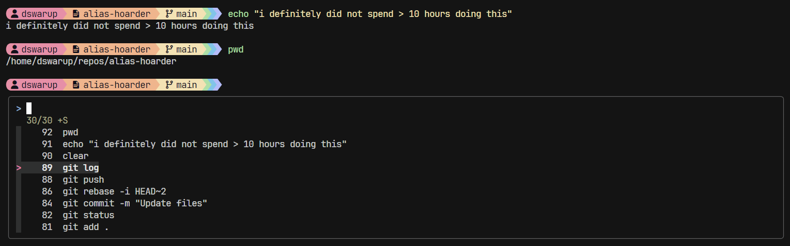
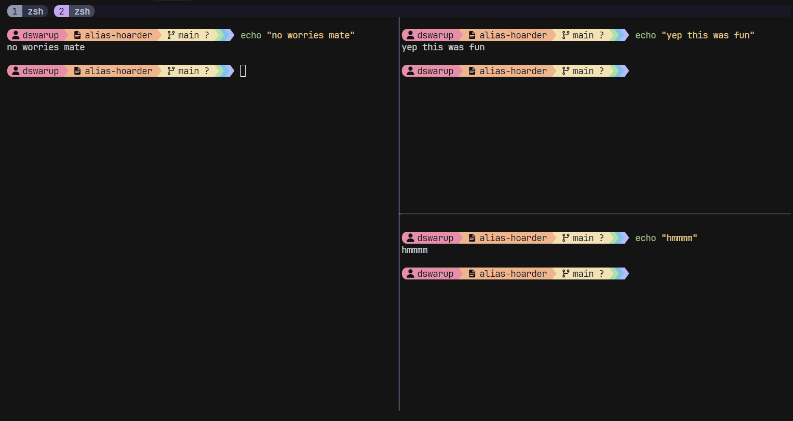

## Overview

Hi. I have a problem. An incessant need to automate everything. 

> "Normally, if given the choice between doing something and nothing, I’d choose to do nothing. But I will do something if it helps someone else do nothing. I’d work all night, if it meant nothing got done." - Ron Swanson

Anyway, this repo contains everything to configure my workflow.

**Note: This is for Ubuntu/Wsl only. For now**  
## Prerequisites

Before installing the configurations, you should set up the following to get the best visual experience:

### NerdFonts Installation

The terminal configurations use NerdFonts for proper icon display. Install a NerdFont of your choice:

1. **Download a NerdFont** from [NerdFonts.com](https://www.nerdfonts.com/font-downloads)
   - Popular choices: `FiraCode Nerd Font`, `JetBrainsMono Nerd Font`, `Hack Nerd Font`
   - Download the font zip file

2. **Install the font:**
   - **Linux:** Extract and copy `.ttf` files to `~/.local/share/fonts/` or `/usr/share/fonts/`
   - **macOS:** Double-click the `.ttf` files to install via Font Book
   - **Windows:** Right-click `.ttf` files and select "Install"

3. **Configure your terminal** to use the installed NerdFont

### Catppuccin Theme Installation

Install the Catppuccin theme for your terminal to match the color scheme:

#### For popular terminals:

- **Windows Terminal:** Follow [Catppuccin Windows Terminal](https://github.com/catppuccin/windows-terminal) instructions
- **GNOME Terminal:** Follow [Catppuccin GNOME Terminal](https://github.com/catppuccin/gnome-terminal) instructions

Or visit the main [Catppuccin repository](https://github.com/catppuccin/catppuccin) for more terminal options.

## Zsh

Install zsh with Oh My Zsh, Starship prompt, and plugins:



```bash
curl -fsSL https://raw.githubusercontent.com/dhruvswarup123/alias-hoarder/main/zsh/install.sh | bash
```
```bash
wget -qO- https://raw.githubusercontent.com/dhruvswarup123/alias-hoarder/main/zsh/install.sh | bash
```

## Tmux

Install tmux with custom configuration and plugins:



```bash
curl -fsSL https://raw.githubusercontent.com/dhruvswarup123/alias-hoarder/main/tmux/install.sh | bash
```
```bash
wget -qO- https://raw.githubusercontent.com/dhruvswarup123/alias-hoarder/main/tmux/install.sh | bash
```
